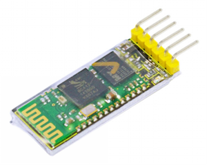
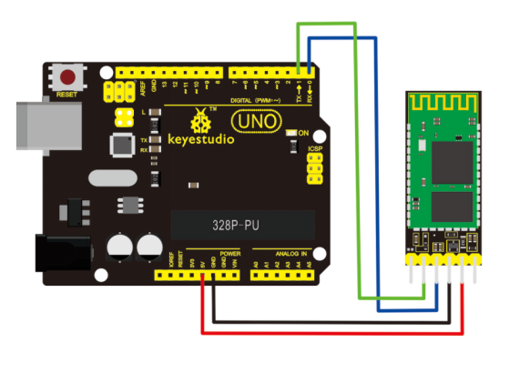

# KS0097 keyestudio Bluetooth Transmission Module for Arduino with Bottom HC-05 Master and Slave



## 1. Introduction

Bluetooth transmission module can enable you to get rid of using cable for a serial port device and realize wireless serial communication within 10 meters.

Using the module doesn't require knowing the complex Bluetooth bottom protocol. A few simple steps can get you to enjoy the convenience of wireless communication.

Bluetooth transmission module has only 4 AT command. Respectively are communication testing, name changing, baud rate changing, matching password changing.

AT command must be set from TXD, RXD signal pins, not via Bluetooth channel. Device sending the AT command can be various types of MCU (for example, 51, avr, PIC, msp430, arm, etc.).

It can also be a computer sending via serial port (PC serial port connected to MAX232 or USB serial port).

## 2. Specification

- core module uses HC-05 slave module, pins include VCC, GND, TXD, RXD, KEY, Bluetooth state pin (STATE), output low if not connected, high if connected
- LED indicates the connection status of Bluetooth, quick flash means no connectivity, slow flash means entering AT mode, double flash means Bluetooth is connected and the port is open.
- Bottom plate has anti-reverse diode,with 3.3V LDO. input volt is 3.6~6V; current about 30mA with no pairing, current about 10mA after pairing. Input volt should be within 7V!
- Pin level is 3.3V. It can be directly connected with various MCUs (51, AVR, PIC, ARM, MSP43 etc.) , also 5V MCUs, no need for MAX232 and cannot be connected with MAX232!
- In open area, effective range is 10m (power level is CLASS 2). It’s possible to be more than 10m. But the connecting quality cannot be guaranteed.
- After paring , it can be used as full duplex serial port. No need for knowing any Bluetooth protocol. It supports 8-bit data bits, 1 stop bit; can set odd-even check communication format, which is the most common communication format; do not support other formats.
- Can access AT command to set parameters, and query information by pulling high pin 34.
- Small size (3.57cm*1.52cm), SMD production, ensure quality; with transparent heat shrinkable film for dustproof and anti-static function.
- Use AT-command to switch from master or slave mode, and to connect to specific devices.
- Support standard baud rate of 4800bps~1382400bps.

## 3. Connection Diagram



## 4. Sample Code

Download code and APP :  [Resource](./Resource.7z)

```c
int val; 
int ledpin=13; 

void setup() 
{ 
	Serial.begin(9600);
    pinMode(ledpin,OUTPUT); 
} 

void loop()
{ 
    val=Serial.read(); 
    if(val=='a')
    { 
        digitalWrite(ledpin,HIGH); 
        delay(250); 
        digitalWrite(ledpin,LOW); 
        delay(250);
        Serial.println("keyestudio");
    }
}
```

